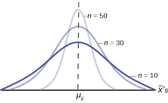

```{r, include=FALSE}
knitr::opts_chunk$set(
  results='asis', 
  echo = FALSE
)
library(tidyverse)
library(glue)
library(scholar)

# Set this to true to have links turned into footnotes at the end of the document
PDF_EXPORT <- FALSE

# Holds all the links that were inserted for placement at the end
links <- c()

source('parsing_functions.R')


# First let's get the data, filtering to only the items tagged as
# Resume items
position_data <- read_csv('positions.csv') %>% 
  filter(in_resume) %>% 
  mutate(
    # Build some custom sections by collapsing others
    section = case_when(
      section %in% c('research_positions', 'industry_positions') ~ 'positions', 
      section %in% c('data_science_writings', 'by_me_press') ~ 'writings',
      TRUE ~ section
    )
  ) 

```


Aside
================================================================================


{width=100%}

Contact {#contact}
--------------------------------------------------------------------------------


- <i class="fa fa-envelope"></i> stacybw@gmail.com
- <i class="fa fa-twitter"></i> brianstacyecon
- <i class="fa fa-github"></i> github.com/stacybri
- <i class="fa fa-link"></i> [website](https://sites.google.com/site/brianstacyecon/)


Skills {#skills}
--------------------------------------------------------------------------------


Highly experienced in


- R 
- Stata

Experience with


- Python
- SQL
- SAS


Open Source Contributions {#open-source}
--------------------------------------------------------------------------------

All projects available at `github.com/stacybri/<name>` or `https://github.com/worldbank/`


- `GEPD`: R & Stata code to replicate Global Education Policy Dashboard work


More info {#more-info}
--------------------------------------------------------------------------------

See [website](https://sites.google.com/site/brianstacyecon/) for more information.


Disclaimer {#disclaimer}
--------------------------------------------------------------------------------

Made w/ [**pagedown**](https://github.com/rstudio/pagedown). 

The source code is available at [github.com/stacybri/cv](https://github.com/stacybri/cv).

Last updated on `r Sys.Date()`.


Main
================================================================================

Brian Stacy {#title}
--------------------------------------------------------------------------------

```{r}
intro_text <- "Economics researcher with experience leading teams to undertake rigorous research on issues relating to education, labor markets, poverty, and development.
"


cat(sanitize_links(intro_text))
```


Education {data-icon=graduation-cap data-concise=true}
--------------------------------------------------------------------------------

```{r}
position_data %>% print_section('education')
```


Selected Positions {data-icon=suitcase}
--------------------------------------------------------------------------------

```{r}
position_data %>% print_section('positions')
```

Selected Writing {data-icon=newspaper}
--------------------------------------------------------------------------------


```{r}
position_data %>% print_section('academic_articles')
```


Citations {data-icon=newspaper}
--------------------------------------------------------------------------------
```{r echo=FALSE, fig.width=8,fig.height=4}
id<-"MACGlOYAAAAJ"

cites<-get_citation_history(id)

p<-ggplot(cites, aes(x=year, y=cites)) +
  geom_bar(stat='identity', fill="steelblue") +
  geom_text(aes(label=cites), vjust=1.2, color="white", size=5) +
  theme_minimal() +
  scale_y_continuous(name="Citations") +
  theme(axis.title = element_text(size=14),
        title = element_text(size=16),
        axis.text = element_text(size=12)) +
  ggtitle("Citations For All Articles",)

p
```

