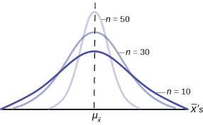

```{r, include=FALSE}
knitr::opts_chunk$set(
  results='asis', 
  echo = FALSE
)
library(tidyverse)
library(glue)

# Set this to true to have links turned into footnotes at the end of the document
PDF_EXPORT <- FALSE

# Holds all the links that were inserted for placement at the end
links <- c()

source('parsing_functions.R')


# First let's get the data, filtering to only the items tagged as
# Resume items. data/positions.csv is hand-maintained (education, positions,
# teaching); data/publications_auto.csv is regenerated from ORCID + OpenAlex
# by scripts/fetch_publications.R, so new papers show up without hand-editing.
# start/end are forced to character (not guessed per-file) because
# data/positions.csv can contain "current", which would otherwise make the
# two files' column types disagree and break bind_rows().
position_cols <- cols(
  section = col_character(),
  in_resume = col_logical(),
  title = col_character(),
  loc = col_character(),
  institution = col_character(),
  start = col_character(),
  end = col_character(),
  description_1 = col_character(),
  description_2 = col_character(),
  description_3 = col_character()
)

position_data <- bind_rows(
    read_csv('data/positions.csv', col_types = position_cols),
    read_csv('data/publications_auto.csv', col_types = position_cols)
  ) %>%
  filter(in_resume) %>%
  mutate(
    # Build some custom sections by collapsing others
    section = case_when(
      section %in% c('research_positions', 'industry_positions') ~ 'positions',
      section %in% c('data_science_writings', 'by_me_press') ~ 'writings',
      TRUE ~ section
    )
  )

```


Aside
================================================================================


{width=100%}

Contact {#contact}
--------------------------------------------------------------------------------


- <i class="fa fa-envelope"></i> stacybw@gmail.com
- <i class="fa fa-twitter"></i> brianstacyecon
- <i class="fa fa-github"></i> github.com/stacybri
- <i class="fa fa-link"></i> [website](https://sites.google.com/site/brianstacyecon/)


Skills {#skills}
--------------------------------------------------------------------------------


Highly experienced in


- R 
- Stata

Experience with


- Python
- SQL
- SAS


Open Source Contributions {#open-source}
--------------------------------------------------------------------------------

All projects available at `github.com/stacybri`


More info {#more-info}
--------------------------------------------------------------------------------

See [website](https://sites.google.com/site/brianstacyecon/) for more information.


Disclaimer {#disclaimer}
--------------------------------------------------------------------------------

Made w/ [**pagedown**](https://github.com/rstudio/pagedown). 

The source code is available at [github.com/stacybri/cv](https://github.com/stacybri/cv).

Last updated on `r Sys.Date()`.


Main
================================================================================

Brian Stacy {#title}
--------------------------------------------------------------------------------

```{r}
intro_text <- "Economics researcher with experience leading teams to undertake rigorous research on issues relating to education, labor markets, poverty, and development.
"


cat(sanitize_links(intro_text))
```


Education {data-icon=graduation-cap data-concise=true}
--------------------------------------------------------------------------------

```{r}
position_data %>% print_section('education')
```


Selected Positions {data-icon=suitcase}
--------------------------------------------------------------------------------

```{r}
position_data %>% print_section('positions')
```

Selected Writing {data-icon=newspaper}
--------------------------------------------------------------------------------


```{r}
position_data %>% print_section('academic_articles')
```


